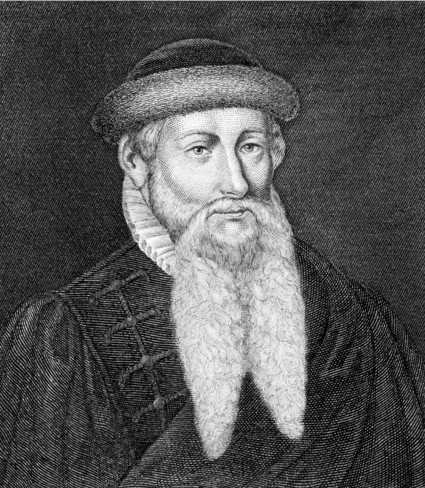

# Assignment #1 - Notes and Sources

## Topic Brainstorming 
- Reformation
- Printing Press
- History of the Education of Women in the 16th Century
- History of Magic in the 16th century

## Potential sources to cite

### William Barker. (2018). Richard Mulcaster’s Positions Concerning the Training up of Children. University of Toronto Press.
  * First published 1581 - "At the time of publication (1581), Mulcaster was
headmaster of Merchant Taylors' School, the largest school in London." *Introduction*, pg xiii
  * Note 36 of the introduction: 
  * Cornelius Agrippa A Treatise of the Nobilitie and Excellencye of Woman Kynde
(first published in Latin in 152.9; English trans 1542.); 
  * L. Vives A Very Frutefull
and Pleasant Boke Called the Instruction of a Christen Woman (first published in
Latin in 152.3; English trans 152.9, rpt, slightly condensed, in Foster Watson
Vives and the Renascence Education of Women);
  * Sir Thomas Elyot The Defence of
Good Women (1540)

### Eisenstein, E. L. (2012). The Printing Revolution in Early Modern Europe (2nd ed.). Cambridge: Cambridge University Press.
- track 3: “exactly repeatable pictorial statement” repeatable images go back to ancient seals and coins. (20:00) 
- “blocks and aides in the hands of expert craftsmen under supervision”
- mathematical tables were transformed (scientific changes) similar to images and words
- The First century of printing
- Block print and letter press were diverse and disparate. But the two techniques became intertwined. The Illuminator and the scribe were both affected by these innovations. 
- New skills emerged as occupational mutations. Bookmaking existed before, but the advent of printing led to a regrouping , closer contact between diversely skilled workers (26:16) e.g early printers were often former priests. New ways of coordinating the work of brains eyes and hands. 
- The master printer bridged many worlds. Production schedules, book markets, sales, enterprise management, prosperity leading to the print shop as a cultural centre.
- “Manuscript dealers”
- Italian humanists
- Shop structures
- Printers = prototypes of early capitalist and heir to Atticus. Wide repertoire of roles. 
- Alder’s house: 30 members! 
- Occupational mutation: scribe to printer.
- Retail trade to wholesale industry 
- New distribution outlets 
- Sales catalogues could be printed helping to tap new markets and edge out competitors! 
- Customers = who would benefit from better indexes and more well organized books? Churches etc 
- Types can be passed down to sons so the business continues
- Music printing!
- Competitive and commercial drives among university faculties
- Recouping initial investment and use reams of paper 
- Setting up a press in a monastery brought ineherent issues of money and commerce into a context previously concerned only with spiritual matters 
- fame rose, of individuals who could be well known now. A “publicity apparatus”! Controlled by printers. 
- Printed calendars and indulgences (mass production)

### Olson, D. R. (2025, January 8). writing. Encyclopedia Britannica. https://www.britannica.com/topic/writing
**Literacy: the uses of writing**
> "It is perhaps characteristic of alphabet-based conceptions of literacy to draw a strict distinction between reading and interpreting. As interpretation came to be seen as interpolation into or distortion of the text, the attempt was made to write texts in such a manner as to reduce the possibility of variant interpretations. This resulted in the attempt to write texts with univocal meanings, texts that mean neither more nor less than what they say. To achieve this required the formalization of grammatical structures, the conventionalization of meanings of terms, and the invention of standard punctuation. Such textual developments were especially important for the specialized functions of science and philosophy. The distinction between meaning and interpretation fostered the idea that texts have a literal meaning, that knowledge can be completely expressed by means of such literal meanings, and that texts can be autonomous and objective. In the Western tradition, knowledge is treated as if it were an ideal text, as something that is regarded by most learners as given rather than created. <mark style="background-color: goldenrod">These assumptions about meaning were important to both the literary and the scientific traditions that took form in western Europe in the 17th century and that continue to this day.</mark>
...

> <mark style="background-color: goldenrod">Writing allows exactly repeatable statements to be circulated widely and preserved. It allows readers to scan a text back and forth and to study, compare, and interpret at their leisure. It allows writers to deliberate over word choice and to construct lists, tables, recipes, and indexes. It fosters an objectified sense of time, a linear conception of space. It separates the message from the author and from the context in which it was written, thereby “decontextualizing,” or universalizing the meaning of, language. It allows the creation of new forms of verbal structure, such as the syllogism, and of numerical structures, such as the multiplication table. When writing becomes a predominant institutional and archival form, it has contributed to the replacement of myth by history and the replacement of magic by skepticism and science. Writing has permitted the development of extensive bureaucracy, accounting, and legal systems organized on the basis of explicit rules and procedures. Writing has replaced face-to-face governance with written law and depersonalized administrative procedures. And, on the other hand, it has turned writers from scribes into authors and thereby contributed to the recognition of the importance of the thoughts of individuals and consequently to the development of individualism."

### Lehmann-Haupt, H. E. (2024, December 18). Johannes Gutenberg. Encyclopedia Britannica. https://www.britannica.com/biography/Johannes-Gutenberg

* **Media Title:**
Johannes Gutenberg

* **Media Type**:
Image

* **Website Name**:
Encyclopædia Britannica

* **Publisher**:
Encyclopædia Britannica

* **URL**:
[PHOTO OF JOHANNES GUTENBERG](https://www.britannica.com/biography/Johannes-Gutenberg#/media/1/249878/187135)

* **Access Date**:
January 18, 2025

